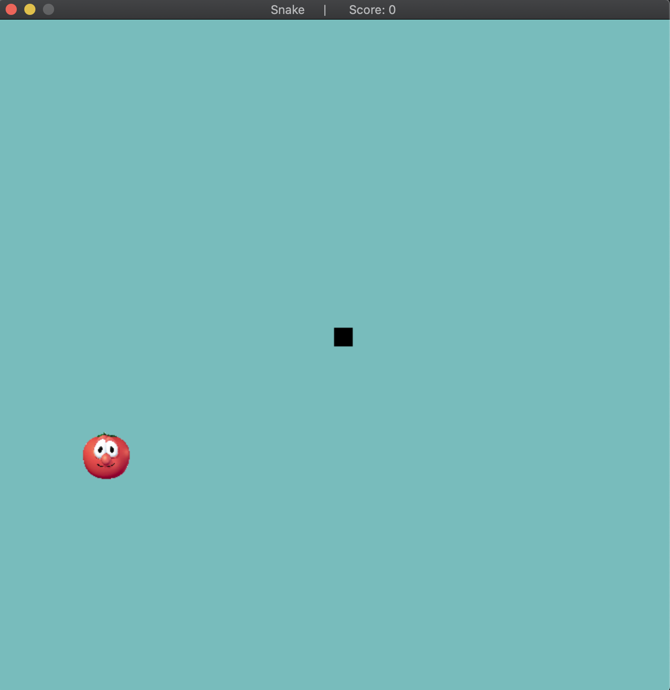

# Snake
 ## Authors:
 [Julia Bayless](https://github.com/jbayl006)
 [Nathan Gurnee](https://github.com/nathangurnee)
 [Sulaiman Ahmed](https://github.com/sulaiman-ahmed)
 
## Project Description
### Why is it important or interesting to you?
  We decided to do Snake as our project because it seemed like an interesting choice and gamefication of learning is something we all as a group wholeheartedly agree with. We want to be able to make something we could use in a fun way,  while at the same time keeping the complexity.
 ### What languages/tools/technologies do you plan to use? (This list may change over the course of the project)
 * C++ - Language used for implementation of game functionality.
 * OpenGL - Graphics API used to render game.
 * Simple DirectMedia Layer - Library used with OpenGL to handle I/O and creation of OpenGL instances.
 ### What will be the input/output of your project?
 * Input - Keystrokes made by user.
 * Output - Movement of snake, display of game.
 ### What are the three design patterns you will be using?
 1. **Composite** - We want to have a base class for our graphic, since we will be re-drawing the graphic every frame. The graphic itself will consist of three subclasses - the snake, the food, and the border of the playing space. These will be drawn to the screen differently, based on which class calls the draw function.
 2. **Strategy** - The snake and the food will both move around the game board. They each have a unique movement, and the strategy pattern will allow us to alter a move method depending on the object.
 3. **Singleton** - There will only be a single instance of the image being drawn over the course of the game. The image is of Bob the Tomato. This image will change in position around the board, but it will still be the same image. This pattern will ensure that we use the same image every draw call.

## Class Diagram
 
 
The `Graphic` abstract base class is the Component for our Composite design pattern. This contains the virtual `draw` method that is implemented by our derived classes. The `Board` class, the Composite, contains all the functionality of the game. Its `draw` method acts as the game loop, handling input and drawing the snake and food to the window. The `Snake` and `Food` Leaf classes are responsible for the attributes of the snake and food respectively. Their `draw` methods focus on their rendering set-up so the `Board` class can draw them during the game loop.

The `Image` class utilizes the Singleton design pattern. Its private constructor and static `getImage` method allows only a single `Image` instance to be created during the game.

The Strategy pattern is used for the `move` method of the `Snake` and the `Food` classes. The Move Strategy differs depending on the type that is calling it, since each class features a unique movement pattern - the food is randomly placed in a spot on the board, and the snake is moved through keyboard input.  
 
 ## Screenshots
  
  This shows the initialization of the snake game. We have the "pineapple" represented by an image of Bob the Tomato and the snake spawns in the middle.
 ## Installation/Usage
 In order to run this program the user will have to have previously installed SDL on their computer. Then the user will compile the program with make and cmake. To run the program the user will have to use ./make to generate the make file and then ./tests to run the tests.
 ## Testing
 To test our program we created unit tests for the separate functions in each one of our classes. Then we ran those unit tests through the google tests that we implemented.
 
